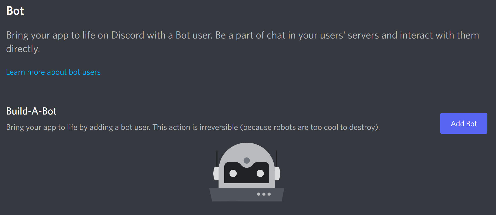
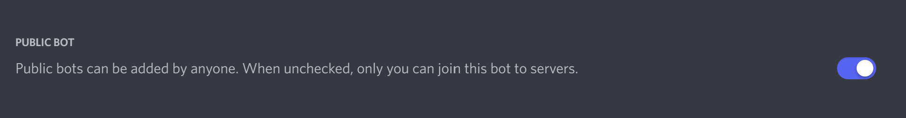
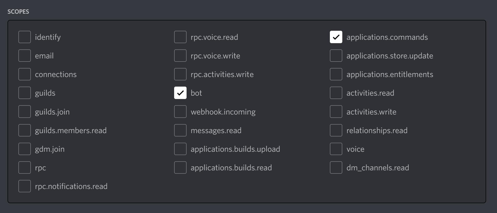
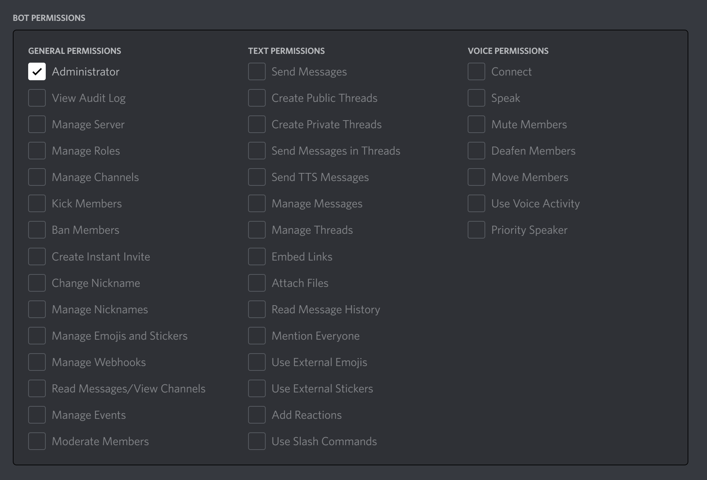

# Discord.js Bot Template

Starter code for a Discord bot, based on [Discord.js](https://discord.js.org/#/). The official guide can be found [here](https://discordjs.guide/).

## Use this template

Fork this repository and run `npm install` to begin.

## Set up a Discord application and create a bot

Firstly, we need to set up a Discord application. We can do this by going to [Discord Developer Portal](https://discord.com/developers/applications) -> New Application. Once we have an application, we can create a bot for it.

In the sidebar, click on "Bot" and add a new bot:

Confirm that you want to add the bot. Bots cannot be deleted. If you do not want others to be able to invite your bot to their server, you can toggle off public bot: 

Now you can invite the bot to your server. Navigate to OAuth2 -> URL Generator. Select `bot` and `applications.commands` for scopes. These scopes allow your bot to interact with users and add [slash commands](https://support.discord.com/hc/en-us/articles/1500000368501-Slash-Commands-FAQ) respectively.

For bot permissions, select the permissions that your bot will require. This depends on what kind of bot you want to build. A poll bot for example may not need administrator permissions. It is always a good idea to only give the permissions the bot requires. For simplicity in this example, we will give it administrator permissions.

Open the generated URL, and you will be able to invite the bot to your server.

## Code the bot

Now we can add code for the bot. In this repo, we are using `.env` file to store our secrets. You do not want to commit or share this file, so be sure to add it to `.gitignore`. You need the following secrets for your bot to work:

- `CLIENTID`: Get this ID by going to your [Discord Application](https://discord.com/developers/applications/) and viewing the "General Information." Copy and paste the "Application ID" into `.env` after `CLIENTID=`
- `TOKEN`: This is your OAuth token. Make sure this is not shared with anyone, as it gives access to your bot. You can get this token in the "Bot" section and "Reset Token." This token is only shown once. Copy and paste it into `.env` after `TOKEN=`
- `GUILDID`: You only need this if you want to make commands that only work in a certain server. You can get this by enabling Developer Mode in Disocrd settings, then right clicking your server icon and selecting "Copy ID".

We can now run `npm run deploy` to make our slash commands available. Then we can run `npm start` to start the bot.

Follow the [official guide](https://discordjs.guide/creating-your-bot/#resulting-code) to understand more about the code in this template, and customize the bot for yourself!
